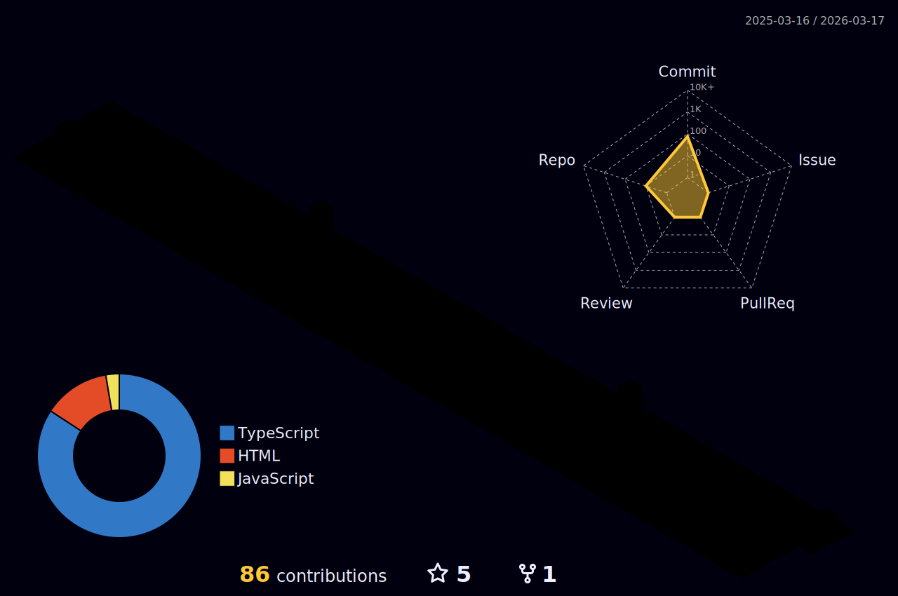

# Hey, I'm Sofia Mendez!
```python
class ReadMe:
    def __init__(self, username="afiorg", year=2022):
        self.username = username
        self.name = 'Sofia Mendez Dantas'
        self.education = {
            'programming': ['Holberton', 'ESTREAM Academy'],
            'Language': ['C', 'Python'],
            'Learning': ['Low-level programming', 'Algorithms', 'Higher-level programming', 'System engineering', 'DevOps'],
        }
```
---


```
def Hey(self):
       print("Thanks for dropping by, hope you find some of my work interesting.")
```
