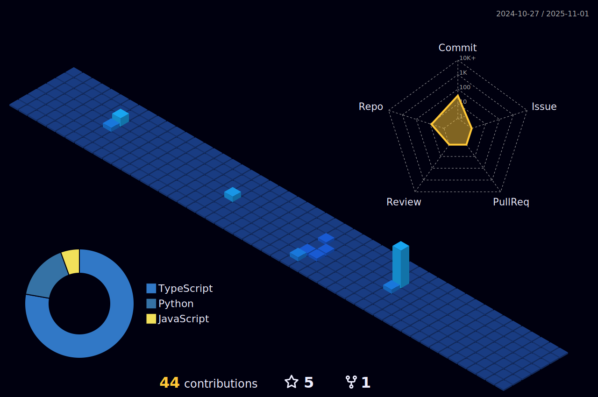

<!-- Header -->
<p align="center">
  
</p>

<!-- Introduction -->
<h1 align="center">👋 Hey, I'm Sofia Mendez!</h1>
<p align="center">
  
</p>

<!-- Code Snippet -->
```python
class ReadMe:
    def __init__(self, username="afiorg9000", year=2022):
        self.username = username
        self.name = 'Sofia Mendez Dantas'
        self.education = {
            'programming': ['Holberton', 'ESTREAM Academy', 'Web3 Bootcamp'],
            'Language': ['C', 'Python', 'JavaScript', 'HTML', 'CSS', 'Ruby', 'Shell', 'Puppet'],
            'Learning': ['Low-level programming', 'System engineering & DevOps', 'Higher-level programming', 'Machine Learning'],
        }
```

<!-- GitHub Stats -->
<p align="center">
  
</p>

```
                “The computer programmer is a creator of universes for which he alone is the lawgiver. 
                           No playwright, no stage director, no emperor, however powerful,
                                has ever exercised such absolute authority to arrange 
                a stage or field of battle and to command such unswervingly dutiful actors or troops.”
                                                
                                                                             ― Joseph Weizenbaum
```

<!-- Connect with Me -->
<h2 align="center">🚀 Connect with Me</h2>
<p align="center">
  <a href="https://github.com/afiorg9000">
    
  </a>
  <a href="https://www.linkedin.com/in/sofia-mendez-dantas/">
    
  </a>
  <a href="mailto:sofiamendezdantas@gmail.com">
    
  </a>
  <a href="https://twitter.com/afiorg9000">
    
  </a>
</p>

