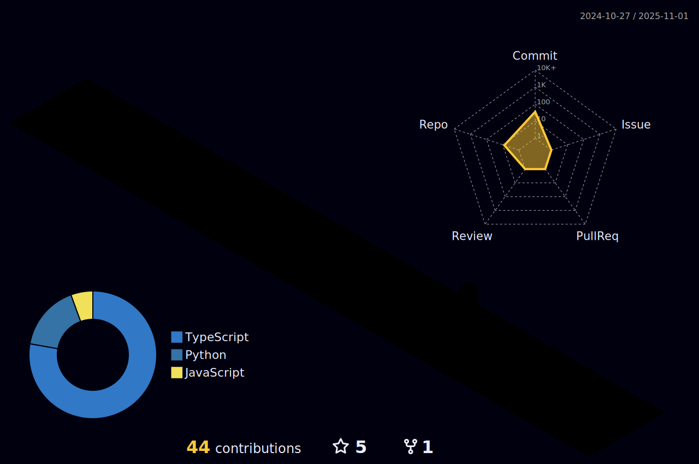

<h1 align="center">
 <abc>
  
[](https://git.io/typing-svg)
  


[](https://git.io/typing-svg)
  
 </abc>
</h1>

```python
class ReadMe:
    def __init__(self, username="afiorg9000", year=2022):
        self.username = username
        self.name = 'Sofia Mendez Dantas'
        self.education = {
            'programming': ['Holberton', 'ESTREAM Academy', 'Web3 Bootcamp'],
            'Language': ['C', 'Python', 'JavaScript', 'HTML', 'CSS', 'Ruby', 'Shell', 'Puppet'],
            'Learning': ['Low-level programing', 'DevOps', 'Higher-level programming'],
        }
```
---


```
               “The computer programmer is a creator of universes for which he alone is the lawgiver. 
                            No playwright, no stage director, no emperor, however powerful,
                                has ever exercised such absolute authority to arrange 
                a stage or field of battle and to command such unswervingly dutiful actors or troops.”
                                                
                                                ― Joseph Weizenbaum
```
